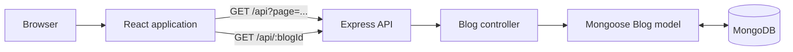

# Jaykay Blog

Jaykay Blog is a small MERN application for publishing and reading technical articles. The React
single-page application lists posts, filters the posts already loaded in the browser, and renders a
selected post from Markdown. The Express API stores and retrieves the posts from MongoDB.

## Repository structure

```text
blog-mern/
├── frontend/               React 19 and Vite 8 single-page application
│   ├── public/             HTML shell, icons, and error images
│   └── src/components/     Page and presentation components
└── backend/                Express and Mongoose REST API
    ├── controller/         Request handlers and pagination logic
    ├── model/              MongoDB Blog schema
    ├── routes/             /api route definitions
    └── server.js           Application and database bootstrap
```

## How the application works



- `/` loads seven posts at a time. An `IntersectionObserver` requests the next page when the last
  rendered post becomes visible.
- The search field filters by title on the posts that have already been loaded. The displayed tag
  chips are currently visual only.
- `/blog/:blogId` fetches one article and renders GitHub-flavored Markdown, embedded HTML, syntax-
  highlighted code, optional video, and sharing links.
- `/admin` is registered but currently contains only a placeholder.
- The API exposes create, read, update, and delete operations under `/api`.

## Technology

| Area | Main packages |
| --- | --- |
| Frontend | React 19, React Router 6, Vite 8, React Markdown, date-fns |
| Backend | Node.js, Express 4, Mongoose 8, dotenv, CORS |
| Database | MongoDB |
| Frontend hosting config | Netlify SPA redirect |

## Run locally

### Prerequisites

- Node.js 20.19+ or 22.12+ and npm
- A local MongoDB instance or MongoDB Atlas connection string

### 1. Start the API

```bash
cd backend
npm install
```

Create `backend/.env`:

```dotenv
MONGODB_URI=mongodb://127.0.0.1:27017/jaykay-blog
PORT=4000
```

Then start the development server:

```bash
npm run dev
```

The API is available at `http://localhost:4000/api`.

### 2. Start the frontend

In a second terminal:

```bash
cd frontend
npm install
npm run dev
```

The application opens at `http://localhost:5173`.

> **Important:** the current frontend source calls the deployed AWS Lambda API URL directly. It
> does not automatically use the local server on port 4000. To test the complete stack locally,
> replace the API base URL in `Home.jsx` and `BlogContentLayout.jsx` with
> `http://localhost:4000/api`. A future improvement would be to centralize this URL in a Vite
> environment variable.

## API summary

| Method | Path | Purpose |
| --- | --- | --- |
| `GET` | `/api` | Return all posts, newest first |
| `GET` | `/api?page=1&limit=7` | Return a paginated result |
| `GET` | `/api/:blogId` | Return one post by its public blog ID |
| `POST` | `/api/create` | Create a post |
| `PUT` | `/api/update/:blogId` | Update a post |
| `DELETE` | `/api/delete/:blogId` | Delete a post |

See [frontend/README.md](frontend/README.md) and [backend/README.md](backend/README.md) for component,
schema, request, response, and deployment details.

## Current limitations

- There are no project-specific automated tests yet; the backend `test` script is a placeholder.
- The API has no authentication, so write routes must not be exposed publicly without protection.
- The frontend API URL is hard-coded, and the admin screen is not implemented.
- Raw HTML is enabled in article Markdown. Only trusted authors should be allowed to submit content
  unless HTML is sanitized before rendering.
- API errors are not yet handled with consistent HTTP status codes.

## Verification

The frontend production build completes with `npm run build`. The backend JavaScript files pass
Node's syntax check; integration testing still requires a configured MongoDB database.
